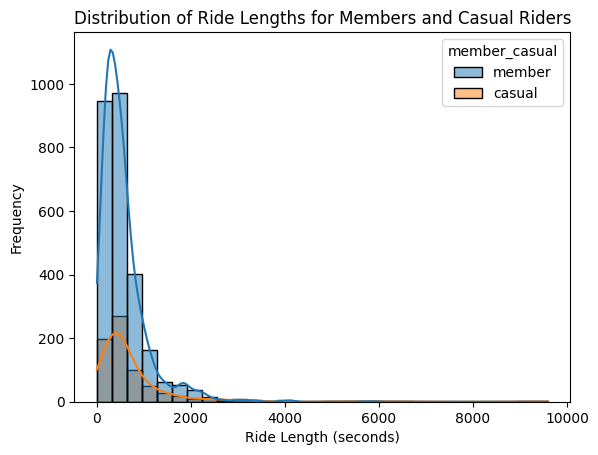
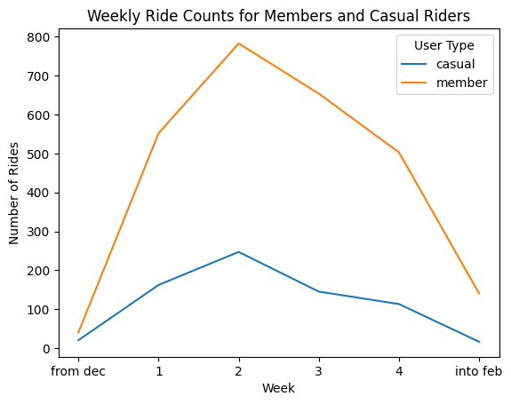
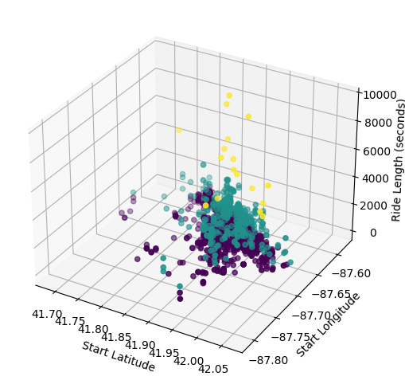
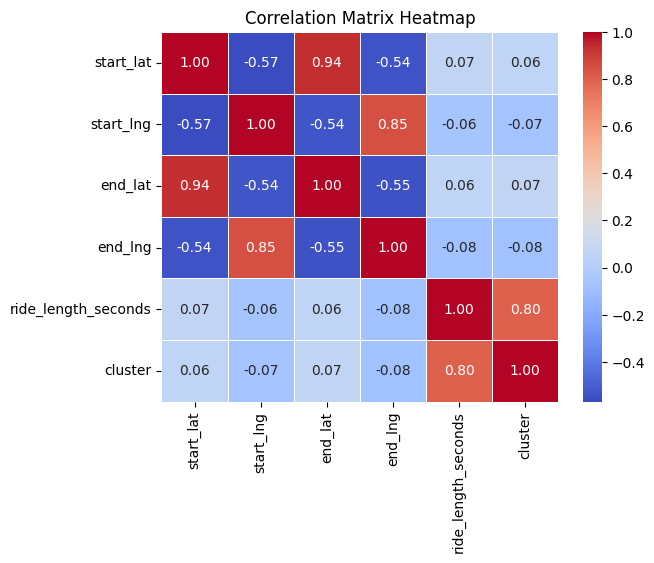
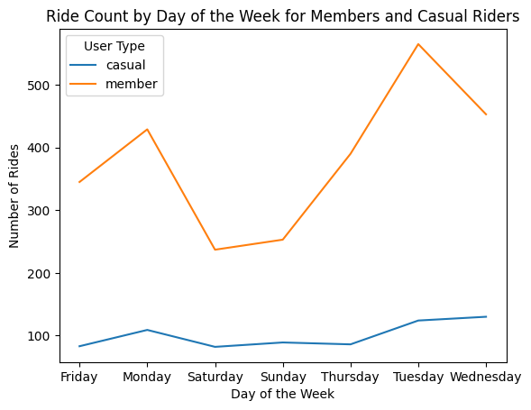
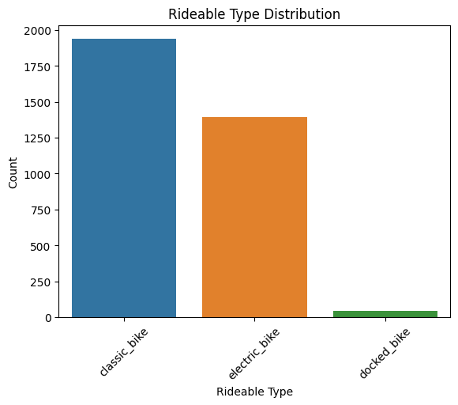

# Introduction

**Cyclistic** operates as a distinguished bike-share program, featuring over 5,800 bicycles and 600 docking stations in Chicago. Launched successfully in 2016, the program now offers a diverse range of bikes, including reclining bikes, hand tricycles, and cargo bikes, aiming for inclusivity for people with disabilities and those unable to use standard two-wheeled bikes. While the majority of users prefer traditional bikes, approximately 8% opt for the assistive options. Cyclistic users primarily ride for leisure, but nearly 30% also utilize the bikes for daily work commutes.

# Ask

## Key Stakeholders

Identifying the key stakeholders crucial for this analysis involves:

- **Lily Moreno**: The director of marketing at Cyclistic and the pivotal figure leading the endeavor to maximize annual memberships. Moreno's insights and directives are fundamental to shaping the strategic decisions derived from this analysis.
- **Cyclistic Marketing Analytics Team**: A group of proficient data analysts responsible for gathering, interpreting, and presenting data pivotal to Cyclistic's marketing strategies. Their expertise contributes significantly to the depth of insights derived from the data analysis.
- **Cyclistic Executive Team**: This detail-oriented executive panel will ultimately greenlight the proposed marketing initiatives based on the data-driven recommendations. Their final approval is crucial for the implementation of the derived strategies.
- **Customers**: An essential stakeholder group encompassing individuals purchasing Cyclistic's services. Understanding their behavioral nuances and preferences is pivotal for designing targeted marketing approaches.

## Business Tasks
Three fundamental questions serve as the cornerstone for shaping Cyclistic's future marketing program:

1. **How do annual members and casual riders use Cyclistic bikes differently?**
2. **Why would casual riders opt for Cyclistic annual memberships?**
3. **How can digital media influence casual riders to transition into members of Cyclistic?**

I am specifically tasked with addressing the first question: **How do annual members and casual riders use Cyclistic bikes differently?**.


# Prepare


## Data Source
The analysis leverages Cyclistic’s historical trip data, available for exploration. However, privacy constraints prohibit connecting pass purchases to individuals' information for location or multiple pass purchases.

### Data Organization
The dataset contains ride details such as ride_id, rideable_type, start and end stations, coordinates, and member type. It's organized with columns indicating ride details and member types.

## ROCCC Assessment
- **Reliable** – *MID* – Only encompasses a fraction of the user base.
- **Original** – *LOW* – Historical data from Cyclistic's database.
- **Comprehensive** – *HIGH* – Provides trip details but lacks user-specific information, but makes up for it my sheer volume of ride data.
- **Current** – *HIGH* – Dataset is recent, spanning a defined period and detailed.
- **Cited** – *LOW* – Internal data from Cyclistic, lacks external validation.

This data quality assessment suggests limitations but remains a valuable resource for exploring ride patterns and user behavior.

# Process

## Import Packages

```python
import pandas as pd  # Data manipulation
import numpy as np  # Numerical computing
import seaborn as sns  # Statistical visualization
import matplotlib.pyplot as plt  # Plotting
from sklearn.cluster import KMeans  # Clustering algorithm
from mpl_toolkits.mplot3d import Axes3D  # 3D plotting
```

## Import Data


```python
df = pd.read_csv("../Data/merged.csv")
```


```python
# Using only top 4000 rows due to compuation
df = df[:4000]

display(df.info())
```

    <class 'pandas.core.frame.DataFrame'>
    RangeIndex: 4000 entries, 0 to 3999
    Data columns (total 13 columns):
     #   Column              Non-Null Count  Dtype  
    ---  ------              --------------  -----  
     0   ride_id             4000 non-null   object 
     1   rideable_type       4000 non-null   object 
     2   started_at          4000 non-null   object 
     3   ended_at            4000 non-null   object 
     4   start_station_name  3381 non-null   object 
     5   start_station_id    3381 non-null   object 
     6   end_station_name    4000 non-null   object 
     7   end_station_id      4000 non-null   object 
     8   start_lat           4000 non-null   float64
     9   start_lng           4000 non-null   float64
     10  end_lat             4000 non-null   float64
     11  end_lng             4000 non-null   float64
     12  member_casual       4000 non-null   object 
    dtypes: float64(4), object(9)
    memory usage: 406.4+ KB


## Calculate ride length


```python
date_format = '%Y-%m-%d %H:%M:%S'
ride_format = '%H:%M:%S'

# Convert strings to datetime
df['started_at'] = pd.to_datetime(df['started_at'],format=date_format)
df['ended_at'] =  pd.to_datetime(df['ended_at'],format=date_format)

# Calculate the time difference and store it in a new column
df['ride_length'] = (df['ended_at'] - df['started_at']).dt.total_seconds()

# Convert to seconds to ride_format
df['ride_length'] = df['ride_length'].apply(lambda x: f'{int(x // 3600)}:{int((x % 3600) // 60)}:{int(x % 60)}')
```

Example


```python
display(df['ride_length'].head())
```


    0    0:10:51
    1     0:8:29
    2    0:13:14
    3     0:8:46
    4    0:15:19
    Name: ride_length, dtype: object


## Calculate day of the week ride started
1 = monday, 7 = sunday


```python
df['day_of_week'] = df['started_at'].dt.day_name()
```

Example


```python
display(df['day_of_week'].head())
```


    0    Saturday
    1     Tuesday
    2      Monday
    3      Sunday
    4    Thursday
    Name: day_of_week, dtype: object


# Analyze

## Clean Data


```python
# Drop null or na rows
df = df.dropna()

# Now null rows
display(df.isna().sum())
```


    ride_id               0
    rideable_type         0
    started_at            0
    ended_at              0
    start_station_name    0
    start_station_id      0
    end_station_name      0
    end_station_id        0
    start_lat             0
    start_lng             0
    end_lat               0
    end_lng               0
    member_casual         0
    ride_length           0
    day_of_week           0
    dtype: int64


## Descriptive Analysis


```python
# Convert ride_length to timedelta format
df['ride_length_seconds'] = pd.to_timedelta(df['ride_length'])

# Convert ride_length to seconds
df['ride_length_seconds'] = df['ride_length_seconds'].dt.total_seconds()
df = df[df['ride_length_seconds']<10000]

# Calculate mean and max ride_length in seconds
mean_ride_length_seconds = df['ride_length_seconds'].mean()
max_ride_length_seconds = df['ride_length_seconds'].max()

# Convert mean and max ride_length back to '%H:%M:%S' format for better readability
mean_ride_length = pd.to_timedelta(mean_ride_length_seconds, unit='seconds',)
max_ride_length = pd.to_timedelta(max_ride_length_seconds, unit='seconds')

# Calculate mode of day_of_week
mode_day_of_week = df['day_of_week'].mode().values[0]

print("Mean ride length:", mean_ride_length)
print("Max ride length:", max_ride_length)
print("Mode day of week:",mode_day_of_week)
```

    Mean ride length: 0 days 00:09:52.373925926
    Max ride length: 0 days 02:39:53
    Mode day of week: Tuesday


## Pivot Tables


```python
# Function to convert seconds to HH:MM:SS format
def convert_seconds_to_time(seconds):
    hours = seconds // 3600
    minutes = (seconds % 3600) // 60
    seconds = seconds % 60
    return f"{int(hours):02d}:{int(minutes):02d}:{int(seconds):02d}"
```


```python
# pivot table with mean ride length in seconds for members and casual riders
pivot_table_1_seconds = df.pivot_table(values='ride_length_seconds', index='member_casual', aggfunc=np.mean)

# pivot table with mean ride length in seconds for users by day_of_week
pivot_table_2_seconds = df.pivot_table(values='ride_length_seconds', index='member_casual', columns='day_of_week', aggfunc=np.mean)

# Convert pivot_tables_seconds values to HH:MM:SS format
pivot_table_1 = pivot_table_1_seconds.applymap(convert_seconds_to_time)
pivot_table_2 = pivot_table_2_seconds.applymap(convert_seconds_to_time)

display(pivot_table_1)
print("-"*100)
display(pivot_table_2)
```


<div>
<style scoped>
    .dataframe tbody tr th:only-of-type {
        vertical-align: middle;
    }

    .dataframe tbody tr th {
        vertical-align: top;
    }

    .dataframe thead th {
        text-align: right;
    }
</style>
<table border="1" class="dataframe">
  <thead>
    <tr style="text-align: right;">
      <th></th>
      <th>ride_length_seconds</th>
    </tr>
    <tr>
      <th>member_casual</th>
      <th></th>
    </tr>
  </thead>
  <tbody>
    <tr>
      <th>casual</th>
      <td>00:12:12</td>
    </tr>
    <tr>
      <th>member</th>
      <td>00:09:15</td>
    </tr>
  </tbody>
</table>
</div>


    ----------------------------------------------------------------------------------------------------


<div>
<style scoped>
    .dataframe tbody tr th:only-of-type {
        vertical-align: middle;
    }

    .dataframe tbody tr th {
        vertical-align: top;
    }

    .dataframe thead th {
        text-align: right;
    }
</style>
<table border="1" class="dataframe">
  <thead>
    <tr style="text-align: right;">
      <th>day_of_week</th>
      <th>Friday</th>
      <th>Monday</th>
      <th>Saturday</th>
      <th>Sunday</th>
      <th>Thursday</th>
      <th>Tuesday</th>
      <th>Wednesday</th>
    </tr>
    <tr>
      <th>member_casual</th>
      <th></th>
      <th></th>
      <th></th>
      <th></th>
      <th></th>
      <th></th>
      <th></th>
    </tr>
  </thead>
  <tbody>
    <tr>
      <th>casual</th>
      <td>00:11:59</td>
      <td>00:13:16</td>
      <td>00:11:19</td>
      <td>00:15:50</td>
      <td>00:07:26</td>
      <td>00:12:40</td>
      <td>00:12:11</td>
    </tr>
    <tr>
      <th>member</th>
      <td>00:08:21</td>
      <td>00:09:13</td>
      <td>00:08:31</td>
      <td>00:10:58</td>
      <td>00:08:34</td>
      <td>00:09:09</td>
      <td>00:10:07</td>
    </tr>
  </tbody>
</table>
</div>


# SHARE

## Histogram of ride lengths for members and casual riders


```python
sns.histplot(data=df, x='ride_length_seconds', hue='member_casual', bins=30,kde=True)  # Adjust bins and range
plt.title('Distribution of Ride Lengths for Members and Casual Riders')
plt.xlabel('Ride Length (seconds)')
plt.ylabel('Frequency')
plt.show()
```


    

    


## Weekly ride count over time for different user types


```python
df['week_start'] = df['started_at'].dt.to_period('W').dt.start_time
weekly_ride_counts = df.groupby(['week_start', 'member_casual']).size().unstack()
weekly_ride_counts
weekly_ride_counts.index = ['from dec',1,2,3,4,'into feb']
weekly_ride_counts.plot(kind='line')

plt.title('Weekly Ride Counts for Members and Casual Riders')
plt.xlabel('Week')
plt.ylabel('Number of Rides')
plt.legend(title='User Type')
plt.show()
```


    

    


## K-Means clustering for user segmentation based on ride behavior


```python
# Considering only numeric columns for clustering
cluster_data = df[['ride_length_seconds', 'start_lat', 'start_lng', 'end_lat', 'end_lng']]
kmeans = KMeans(n_clusters=3, random_state=42)
df['cluster'] = kmeans.fit_predict(cluster_data)

customer_segments = df['cluster'].value_counts()
customer_segments.index = ['Casual riders','Moderate riders','Long dist riders']
```


```python
display(customer_segments)
```


    Casual riders       2949
    Moderate riders      409
    Long dist riders      17
    Name: cluster, dtype: int64


## Plot of starting coordinates vs ride length


```python
fig = plt.figure(figsize=(8, 6))
ax = fig.add_subplot(111, projection='3d')
ax.scatter(df['start_lat'], df['start_lng'], df['ride_length_seconds'], c=df['cluster'], cmap='viridis')
ax.set_xlabel('Start Latitude')
ax.set_ylabel('Start Longitude')
ax.set_zlabel('Ride Length (seconds)')
plt.show()
```


    

    


## Correlation matrix heatmap


```python
correlation_matrix = df.corr()
sns.heatmap(correlation_matrix, annot=True, cmap='coolwarm', fmt='.2f',linewidths=0.5)
plt.title('Correlation Matrix Heatmap')
plt.show()
```

    /tmp/ipykernel_16783/943108700.py:1: FutureWarning: The default value of numeric_only in DataFrame.corr is deprecated. In a future version, it will default to False. Select only valid columns or specify the value of numeric_only to silence this warning.
      correlation_matrix = df.corr()


    

    


## Ride count by day of the week for different user types


```python
ride_counts_by_day = df.groupby(['day_of_week', 'member_casual']).size().unstack().fillna(0)
ride_counts_by_day.plot(kind='line')
plt.title('Ride Count by Day of the Week for Members and Casual Riders')
plt.xlabel('Day of the Week')
plt.ylabel('Number of Rides')
plt.legend(title='User Type')
plt.show()

```


    

    


## Rideable type distribution


```python
rideable_counts = df['rideable_type'].value_counts()
sns.barplot(x=rideable_counts.index, y=rideable_counts.values)
plt.title('Rideable Type Distribution')
plt.xlabel('Rideable Type')
plt.ylabel('Count')
plt.xticks(rotation=45)
plt.show()
```


    

    

