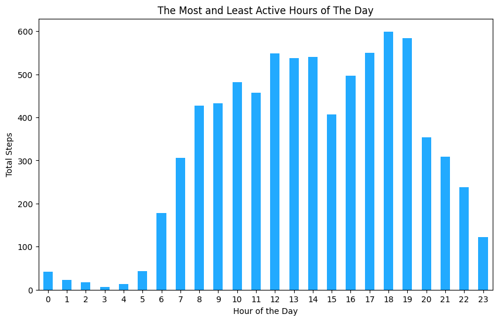

# Introduction

**Bellabeat** stands as a prominent high-tech manufacturer specializing in health-focused products tailored for women, featuring an array of offerings including the Bellabeat app, Leaf, Time, Spring, and Bellabeat membership. Co-founded in 2013 by Urška Sršen and Sando Mur, the company has demonstrated substantial success and harbors significant potential to emerge as a key player in the global smart device industry. **Analyzing smart device fitness data** is believed to hold the key to unlocking novel growth opportunities for the company.

In this case study, I will meticulously follow the six steps of the data analysis process: **ask, prepare, process, analyze, share, and act**. This detailed breakdown will highlight how I delved into the **FitBit Fitness Tracker Data** to extract insights that could prove beneficial for **Bellabeat**.

# Ask

## Key Stakeholders
- **Urška Sršen**: Co-founder and Chief Creative Officer at Bellabeat.
- **Sando Mur**: Co-founder and pivotal member of the Bellabeat executive team.
- **Marketing Analytics Team at Bellabeat**: A team of proficient data analysts responsible for acquiring, scrutinizing, and presenting data crucial for guiding Bellabeat’s marketing strategies.
- **Customers**: All individuals purchasing Bellabeat’s products or availing their services.

## Business Task
- Analyzing FitBit Fitness Tracker Data from thirty eligible FitBit users to uncover insights that could catalyze new growth opportunities for the company.
- Focusing on scrutinizing smart device data related to one of **Bellabeat’s** flagship products to discern customer usage patterns.
- Specifically, delving into the **Bellabeat membership program**, a subscription-based service offering users **24/7 access to personalized guidance on nutrition, activity, sleep, health and beauty, and mindfulness**, tailored to their lifestyle and goals.

# Prepare

## Data Source
The data encompasses a freely accessible FitBit Fitness tracker dataset provided through **Mobius**. It comprises personal fitness tracker data from over thirty FitBit users who consented to share their data. Among the 18 csv files available, the pertinent datasets for my focus include daily activity, hourly calories, hourly steps, and sleep day data.

## Sorting the Data
Upon scrutinizing the chosen datasets in Google Sheets, I discerned that the data is meticulously organized in a comprehensive format. Notably, the **dailyActivity_merged** data contains **key metrics** such as the **total steps taken by Fitbit users, active minutes spent, and calories burned**. These metrics serve as a foundation to establish correlations between burned calories and step count. Furthermore, the **hourly calories** and **hourly steps** datasets offer insights into activity patterns across different hours of the day. 

## ROCCC assesment
- **Reliable** - *LOW* - Not reliable as it only has 30 respondents 
- **Original** - *LOW* - Third party provider (Amazon Mechanical Turk) 
- **Comprehensive** - *MED* - Parameters match most of Bellabeat's products' parameters 
- **Current** - *LOW* - Data is 5 years old and is not relevant 
- **Cited** - *LOW* - Data collected from third party, hence unknown Overall, the dataset is considered bad quality data and it is not recommended to produce business recommendations based on this data.

# PROCESS

## Import Packages
Let's start by loading the libraries we would need for processing and visualizing the data.


```python
import numpy as np # data arrays
import pandas as pd # data structure and data analysis
import matplotlib.pyplot as plt # data visualization
import seaborn as sns # data visualisation
import datetime as dt # date time
import os # file handling
```

## Import data
Next, we'll load the fitbit datasets we're interested in exploring for insights.


```python
# File path to all csv
dir_path = 'Data/'

# Read all CSVs into DataFrames
daily_activity = pd.read_csv(f'{dir_path}dailyActivity_merged.csv')
hourly_steps = pd.read_csv(f'{dir_path}hourlySteps_merged.csv')
hourly_calories = pd.read_csv(f'{dir_path}hourlyCalories_merged.csv')
sleepday = pd.read_csv(f'{dir_path}sleepDay_merged.csv')
daily_calories = pd.read_csv(f'{dir_path}dailyCalories_merged.csv')
daily_intensity = pd.read_csv(f'{dir_path}dailyCalories_merged.csv')
weight_log = pd.read_csv(f'{dir_path}weightLogInfo_merged.csv')
daily_steps = pd.read_csv(f'{dir_path}dailySteps_merged.csv')
heartrate_secs = pd.read_csv(f"{dir_path}heartrate_seconds_merged.csv")

# Dictionary containing DataFrame variables and their names
dfs = {
    'daily_activity': daily_activity,
    'hourly_steps': hourly_steps,
    'hourly_calories': hourly_calories,
    'sleepday': sleepday,
    'daily_calories': daily_calories,
    'daily_intensity': daily_intensity,
    'weight_log': weight_log,
    'daily_steps': daily_steps,
    'heartrate_secs': heartrate_secs
}
```

## EDA
Let's explore our data by viewing some statistical information about them.
We'll start by pulling the first 5 rows of each dataset.


```python
# Display each DataFrame along with its name
for name, df in dfs.items():
    print(f"DataFrame Name: {name}")
    display(df.head())
    print("_"*50)
```

    DataFrame Name: daily_activity


<div>
<style scoped>
    .dataframe tbody tr th:only-of-type {
        vertical-align: middle;
    }

    .dataframe tbody tr th {
        vertical-align: top;
    }

    .dataframe thead th {
        text-align: right;
    }
</style>
<table border="1" class="dataframe">
  <thead>
    <tr style="text-align: right;">
      <th></th>
      <th>Id</th>
      <th>ActivityDate</th>
      <th>TotalSteps</th>
      <th>TotalDistance</th>
      <th>TrackerDistance</th>
      <th>LoggedActivitiesDistance</th>
      <th>VeryActiveDistance</th>
      <th>ModeratelyActiveDistance</th>
      <th>LightActiveDistance</th>
      <th>SedentaryActiveDistance</th>
      <th>VeryActiveMinutes</th>
      <th>FairlyActiveMinutes</th>
      <th>LightlyActiveMinutes</th>
      <th>SedentaryMinutes</th>
      <th>Calories</th>
    </tr>
  </thead>
  <tbody>
    <tr>
      <th>0</th>
      <td>1503960366</td>
      <td>4/12/2016</td>
      <td>13162</td>
      <td>8.50</td>
      <td>8.50</td>
      <td>0.0</td>
      <td>1.88</td>
      <td>0.55</td>
      <td>6.06</td>
      <td>0.0</td>
      <td>25</td>
      <td>13</td>
      <td>328</td>
      <td>728</td>
      <td>1985</td>
    </tr>
    <tr>
      <th>1</th>
      <td>1503960366</td>
      <td>4/13/2016</td>
      <td>10735</td>
      <td>6.97</td>
      <td>6.97</td>
      <td>0.0</td>
      <td>1.57</td>
      <td>0.69</td>
      <td>4.71</td>
      <td>0.0</td>
      <td>21</td>
      <td>19</td>
      <td>217</td>
      <td>776</td>
      <td>1797</td>
    </tr>
    <tr>
      <th>2</th>
      <td>1503960366</td>
      <td>4/14/2016</td>
      <td>10460</td>
      <td>6.74</td>
      <td>6.74</td>
      <td>0.0</td>
      <td>2.44</td>
      <td>0.40</td>
      <td>3.91</td>
      <td>0.0</td>
      <td>30</td>
      <td>11</td>
      <td>181</td>
      <td>1218</td>
      <td>1776</td>
    </tr>
    <tr>
      <th>3</th>
      <td>1503960366</td>
      <td>4/15/2016</td>
      <td>9762</td>
      <td>6.28</td>
      <td>6.28</td>
      <td>0.0</td>
      <td>2.14</td>
      <td>1.26</td>
      <td>2.83</td>
      <td>0.0</td>
      <td>29</td>
      <td>34</td>
      <td>209</td>
      <td>726</td>
      <td>1745</td>
    </tr>
    <tr>
      <th>4</th>
      <td>1503960366</td>
      <td>4/16/2016</td>
      <td>12669</td>
      <td>8.16</td>
      <td>8.16</td>
      <td>0.0</td>
      <td>2.71</td>
      <td>0.41</td>
      <td>5.04</td>
      <td>0.0</td>
      <td>36</td>
      <td>10</td>
      <td>221</td>
      <td>773</td>
      <td>1863</td>
    </tr>
  </tbody>
</table>
</div>


    __________________________________________________
    DataFrame Name: hourly_steps


<div>
<style scoped>
    .dataframe tbody tr th:only-of-type {
        vertical-align: middle;
    }

    .dataframe tbody tr th {
        vertical-align: top;
    }

    .dataframe thead th {
        text-align: right;
    }
</style>
<table border="1" class="dataframe">
  <thead>
    <tr style="text-align: right;">
      <th></th>
      <th>Id</th>
      <th>ActivityHour</th>
      <th>StepTotal</th>
    </tr>
  </thead>
  <tbody>
    <tr>
      <th>0</th>
      <td>1503960366</td>
      <td>4/12/2016 12:00:00 AM</td>
      <td>373</td>
    </tr>
    <tr>
      <th>1</th>
      <td>1503960366</td>
      <td>4/12/2016 1:00:00 AM</td>
      <td>160</td>
    </tr>
    <tr>
      <th>2</th>
      <td>1503960366</td>
      <td>4/12/2016 2:00:00 AM</td>
      <td>151</td>
    </tr>
    <tr>
      <th>3</th>
      <td>1503960366</td>
      <td>4/12/2016 3:00:00 AM</td>
      <td>0</td>
    </tr>
    <tr>
      <th>4</th>
      <td>1503960366</td>
      <td>4/12/2016 4:00:00 AM</td>
      <td>0</td>
    </tr>
  </tbody>
</table>
</div>


    __________________________________________________
    DataFrame Name: hourly_calories


<div>
<style scoped>
    .dataframe tbody tr th:only-of-type {
        vertical-align: middle;
    }

    .dataframe tbody tr th {
        vertical-align: top;
    }

    .dataframe thead th {
        text-align: right;
    }
</style>
<table border="1" class="dataframe">
  <thead>
    <tr style="text-align: right;">
      <th></th>
      <th>Id</th>
      <th>ActivityHour</th>
      <th>Calories</th>
    </tr>
  </thead>
  <tbody>
    <tr>
      <th>0</th>
      <td>1503960366</td>
      <td>4/12/2016 12:00:00 AM</td>
      <td>81</td>
    </tr>
    <tr>
      <th>1</th>
      <td>1503960366</td>
      <td>4/12/2016 1:00:00 AM</td>
      <td>61</td>
    </tr>
    <tr>
      <th>2</th>
      <td>1503960366</td>
      <td>4/12/2016 2:00:00 AM</td>
      <td>59</td>
    </tr>
    <tr>
      <th>3</th>
      <td>1503960366</td>
      <td>4/12/2016 3:00:00 AM</td>
      <td>47</td>
    </tr>
    <tr>
      <th>4</th>
      <td>1503960366</td>
      <td>4/12/2016 4:00:00 AM</td>
      <td>48</td>
    </tr>
  </tbody>
</table>
</div>


    __________________________________________________
    DataFrame Name: sleepday


<div>
<style scoped>
    .dataframe tbody tr th:only-of-type {
        vertical-align: middle;
    }

    .dataframe tbody tr th {
        vertical-align: top;
    }

    .dataframe thead th {
        text-align: right;
    }
</style>
<table border="1" class="dataframe">
  <thead>
    <tr style="text-align: right;">
      <th></th>
      <th>Id</th>
      <th>SleepDay</th>
      <th>TotalSleepRecords</th>
      <th>TotalMinutesAsleep</th>
      <th>TotalTimeInBed</th>
    </tr>
  </thead>
  <tbody>
    <tr>
      <th>0</th>
      <td>1503960366</td>
      <td>4/12/2016 12:00:00 AM</td>
      <td>1</td>
      <td>327</td>
      <td>346</td>
    </tr>
    <tr>
      <th>1</th>
      <td>1503960366</td>
      <td>4/13/2016 12:00:00 AM</td>
      <td>2</td>
      <td>384</td>
      <td>407</td>
    </tr>
    <tr>
      <th>2</th>
      <td>1503960366</td>
      <td>4/15/2016 12:00:00 AM</td>
      <td>1</td>
      <td>412</td>
      <td>442</td>
    </tr>
    <tr>
      <th>3</th>
      <td>1503960366</td>
      <td>4/16/2016 12:00:00 AM</td>
      <td>2</td>
      <td>340</td>
      <td>367</td>
    </tr>
    <tr>
      <th>4</th>
      <td>1503960366</td>
      <td>4/17/2016 12:00:00 AM</td>
      <td>1</td>
      <td>700</td>
      <td>712</td>
    </tr>
  </tbody>
</table>
</div>


    __________________________________________________
    DataFrame Name: daily_calories


<div>
<style scoped>
    .dataframe tbody tr th:only-of-type {
        vertical-align: middle;
    }

    .dataframe tbody tr th {
        vertical-align: top;
    }

    .dataframe thead th {
        text-align: right;
    }
</style>
<table border="1" class="dataframe">
  <thead>
    <tr style="text-align: right;">
      <th></th>
      <th>Id</th>
      <th>ActivityDay</th>
      <th>Calories</th>
    </tr>
  </thead>
  <tbody>
    <tr>
      <th>0</th>
      <td>1503960366</td>
      <td>4/12/2016</td>
      <td>1985</td>
    </tr>
    <tr>
      <th>1</th>
      <td>1503960366</td>
      <td>4/13/2016</td>
      <td>1797</td>
    </tr>
    <tr>
      <th>2</th>
      <td>1503960366</td>
      <td>4/14/2016</td>
      <td>1776</td>
    </tr>
    <tr>
      <th>3</th>
      <td>1503960366</td>
      <td>4/15/2016</td>
      <td>1745</td>
    </tr>
    <tr>
      <th>4</th>
      <td>1503960366</td>
      <td>4/16/2016</td>
      <td>1863</td>
    </tr>
  </tbody>
</table>
</div>


    __________________________________________________
    DataFrame Name: daily_intensity


<div>
<style scoped>
    .dataframe tbody tr th:only-of-type {
        vertical-align: middle;
    }

    .dataframe tbody tr th {
        vertical-align: top;
    }

    .dataframe thead th {
        text-align: right;
    }
</style>
<table border="1" class="dataframe">
  <thead>
    <tr style="text-align: right;">
      <th></th>
      <th>Id</th>
      <th>ActivityDay</th>
      <th>Calories</th>
    </tr>
  </thead>
  <tbody>
    <tr>
      <th>0</th>
      <td>1503960366</td>
      <td>4/12/2016</td>
      <td>1985</td>
    </tr>
    <tr>
      <th>1</th>
      <td>1503960366</td>
      <td>4/13/2016</td>
      <td>1797</td>
    </tr>
    <tr>
      <th>2</th>
      <td>1503960366</td>
      <td>4/14/2016</td>
      <td>1776</td>
    </tr>
    <tr>
      <th>3</th>
      <td>1503960366</td>
      <td>4/15/2016</td>
      <td>1745</td>
    </tr>
    <tr>
      <th>4</th>
      <td>1503960366</td>
      <td>4/16/2016</td>
      <td>1863</td>
    </tr>
  </tbody>
</table>
</div>


    __________________________________________________
    DataFrame Name: weight_log


<div>
<style scoped>
    .dataframe tbody tr th:only-of-type {
        vertical-align: middle;
    }

    .dataframe tbody tr th {
        vertical-align: top;
    }

    .dataframe thead th {
        text-align: right;
    }
</style>
<table border="1" class="dataframe">
  <thead>
    <tr style="text-align: right;">
      <th></th>
      <th>Id</th>
      <th>Date</th>
      <th>WeightKg</th>
      <th>WeightPounds</th>
      <th>Fat</th>
      <th>BMI</th>
      <th>IsManualReport</th>
      <th>LogId</th>
    </tr>
  </thead>
  <tbody>
    <tr>
      <th>0</th>
      <td>1503960366</td>
      <td>5/2/2016 11:59:59 PM</td>
      <td>52.599998</td>
      <td>115.963147</td>
      <td>22.0</td>
      <td>22.650000</td>
      <td>True</td>
      <td>1462233599000</td>
    </tr>
    <tr>
      <th>1</th>
      <td>1503960366</td>
      <td>5/3/2016 11:59:59 PM</td>
      <td>52.599998</td>
      <td>115.963147</td>
      <td>NaN</td>
      <td>22.650000</td>
      <td>True</td>
      <td>1462319999000</td>
    </tr>
    <tr>
      <th>2</th>
      <td>1927972279</td>
      <td>4/13/2016 1:08:52 AM</td>
      <td>133.500000</td>
      <td>294.317120</td>
      <td>NaN</td>
      <td>47.540001</td>
      <td>False</td>
      <td>1460509732000</td>
    </tr>
    <tr>
      <th>3</th>
      <td>2873212765</td>
      <td>4/21/2016 11:59:59 PM</td>
      <td>56.700001</td>
      <td>125.002104</td>
      <td>NaN</td>
      <td>21.450001</td>
      <td>True</td>
      <td>1461283199000</td>
    </tr>
    <tr>
      <th>4</th>
      <td>2873212765</td>
      <td>5/12/2016 11:59:59 PM</td>
      <td>57.299999</td>
      <td>126.324875</td>
      <td>NaN</td>
      <td>21.690001</td>
      <td>True</td>
      <td>1463097599000</td>
    </tr>
  </tbody>
</table>
</div>


    __________________________________________________
    DataFrame Name: daily_steps


<div>
<style scoped>
    .dataframe tbody tr th:only-of-type {
        vertical-align: middle;
    }

    .dataframe tbody tr th {
        vertical-align: top;
    }

    .dataframe thead th {
        text-align: right;
    }
</style>
<table border="1" class="dataframe">
  <thead>
    <tr style="text-align: right;">
      <th></th>
      <th>Id</th>
      <th>ActivityDay</th>
      <th>StepTotal</th>
    </tr>
  </thead>
  <tbody>
    <tr>
      <th>0</th>
      <td>1503960366</td>
      <td>4/12/2016</td>
      <td>13162</td>
    </tr>
    <tr>
      <th>1</th>
      <td>1503960366</td>
      <td>4/13/2016</td>
      <td>10735</td>
    </tr>
    <tr>
      <th>2</th>
      <td>1503960366</td>
      <td>4/14/2016</td>
      <td>10460</td>
    </tr>
    <tr>
      <th>3</th>
      <td>1503960366</td>
      <td>4/15/2016</td>
      <td>9762</td>
    </tr>
    <tr>
      <th>4</th>
      <td>1503960366</td>
      <td>4/16/2016</td>
      <td>12669</td>
    </tr>
  </tbody>
</table>
</div>


    __________________________________________________
    DataFrame Name: heartrate_secs


<div>
<style scoped>
    .dataframe tbody tr th:only-of-type {
        vertical-align: middle;
    }

    .dataframe tbody tr th {
        vertical-align: top;
    }

    .dataframe thead th {
        text-align: right;
    }
</style>
<table border="1" class="dataframe">
  <thead>
    <tr style="text-align: right;">
      <th></th>
      <th>Id</th>
      <th>Time</th>
      <th>Value</th>
    </tr>
  </thead>
  <tbody>
    <tr>
      <th>0</th>
      <td>2022484408</td>
      <td>4/12/2016 7:21:00 AM</td>
      <td>97</td>
    </tr>
    <tr>
      <th>1</th>
      <td>2022484408</td>
      <td>4/12/2016 7:21:05 AM</td>
      <td>102</td>
    </tr>
    <tr>
      <th>2</th>
      <td>2022484408</td>
      <td>4/12/2016 7:21:10 AM</td>
      <td>105</td>
    </tr>
    <tr>
      <th>3</th>
      <td>2022484408</td>
      <td>4/12/2016 7:21:20 AM</td>
      <td>103</td>
    </tr>
    <tr>
      <th>4</th>
      <td>2022484408</td>
      <td>4/12/2016 7:21:25 AM</td>
      <td>101</td>
    </tr>
  </tbody>
</table>
</div>


    __________________________________________________


Let's view the columns and their data types in each dataset.


```python
for name, df in dfs.items():
    print(f"DataFrame Name: {name}")
    print(df.info())
    print("_"*50)
```

    DataFrame Name: daily_activity
    <class 'pandas.core.frame.DataFrame'>
    RangeIndex: 940 entries, 0 to 939
    Data columns (total 15 columns):
     #   Column                    Non-Null Count  Dtype  
    ---  ------                    --------------  -----  
     0   Id                        940 non-null    int64  
     1   ActivityDate              940 non-null    object 
     2   TotalSteps                940 non-null    int64  
     3   TotalDistance             940 non-null    float64
     4   TrackerDistance           940 non-null    float64
     5   LoggedActivitiesDistance  940 non-null    float64
     6   VeryActiveDistance        940 non-null    float64
     7   ModeratelyActiveDistance  940 non-null    float64
     8   LightActiveDistance       940 non-null    float64
     9   SedentaryActiveDistance   940 non-null    float64
     10  VeryActiveMinutes         940 non-null    int64  
     11  FairlyActiveMinutes       940 non-null    int64  
     12  LightlyActiveMinutes      940 non-null    int64  
     13  SedentaryMinutes          940 non-null    int64  
     14  Calories                  940 non-null    int64  
    dtypes: float64(7), int64(7), object(1)
    memory usage: 110.3+ KB
    None
    __________________________________________________
    DataFrame Name: hourly_steps
    <class 'pandas.core.frame.DataFrame'>
    RangeIndex: 22099 entries, 0 to 22098
    Data columns (total 3 columns):
     #   Column        Non-Null Count  Dtype 
    ---  ------        --------------  ----- 
     0   Id            22099 non-null  int64 
     1   ActivityHour  22099 non-null  object
     2   StepTotal     22099 non-null  int64 
    dtypes: int64(2), object(1)
    memory usage: 518.1+ KB
    None
    __________________________________________________
    DataFrame Name: hourly_calories
    <class 'pandas.core.frame.DataFrame'>
    RangeIndex: 22099 entries, 0 to 22098
    Data columns (total 3 columns):
     #   Column        Non-Null Count  Dtype 
    ---  ------        --------------  ----- 
     0   Id            22099 non-null  int64 
     1   ActivityHour  22099 non-null  object
     2   Calories      22099 non-null  int64 
    dtypes: int64(2), object(1)
    memory usage: 518.1+ KB
    None
    __________________________________________________
    DataFrame Name: sleepday
    <class 'pandas.core.frame.DataFrame'>
    RangeIndex: 413 entries, 0 to 412
    Data columns (total 5 columns):
     #   Column              Non-Null Count  Dtype 
    ---  ------              --------------  ----- 
     0   Id                  413 non-null    int64 
     1   SleepDay            413 non-null    object
     2   TotalSleepRecords   413 non-null    int64 
     3   TotalMinutesAsleep  413 non-null    int64 
     4   TotalTimeInBed      413 non-null    int64 
    dtypes: int64(4), object(1)
    memory usage: 16.3+ KB
    None
    __________________________________________________
    DataFrame Name: daily_calories
    <class 'pandas.core.frame.DataFrame'>
    RangeIndex: 940 entries, 0 to 939
    Data columns (total 3 columns):
     #   Column       Non-Null Count  Dtype 
    ---  ------       --------------  ----- 
     0   Id           940 non-null    int64 
     1   ActivityDay  940 non-null    object
     2   Calories     940 non-null    int64 
    dtypes: int64(2), object(1)
    memory usage: 22.2+ KB
    None
    __________________________________________________
    DataFrame Name: daily_intensity
    <class 'pandas.core.frame.DataFrame'>
    RangeIndex: 940 entries, 0 to 939
    Data columns (total 3 columns):
     #   Column       Non-Null Count  Dtype 
    ---  ------       --------------  ----- 
     0   Id           940 non-null    int64 
     1   ActivityDay  940 non-null    object
     2   Calories     940 non-null    int64 
    dtypes: int64(2), object(1)
    memory usage: 22.2+ KB
    None
    __________________________________________________
    DataFrame Name: weight_log
    <class 'pandas.core.frame.DataFrame'>
    RangeIndex: 67 entries, 0 to 66
    Data columns (total 8 columns):
     #   Column          Non-Null Count  Dtype  
    ---  ------          --------------  -----  
     0   Id              67 non-null     int64  
     1   Date            67 non-null     object 
     2   WeightKg        67 non-null     float64
     3   WeightPounds    67 non-null     float64
     4   Fat             2 non-null      float64
     5   BMI             67 non-null     float64
     6   IsManualReport  67 non-null     bool   
     7   LogId           67 non-null     int64  
    dtypes: bool(1), float64(4), int64(2), object(1)
    memory usage: 3.9+ KB
    None
    __________________________________________________
    DataFrame Name: daily_steps
    <class 'pandas.core.frame.DataFrame'>
    RangeIndex: 940 entries, 0 to 939
    Data columns (total 3 columns):
     #   Column       Non-Null Count  Dtype 
    ---  ------       --------------  ----- 
     0   Id           940 non-null    int64 
     1   ActivityDay  940 non-null    object
     2   StepTotal    940 non-null    int64 
    dtypes: int64(2), object(1)
    memory usage: 22.2+ KB
    None
    __________________________________________________
    DataFrame Name: heartrate_secs
    <class 'pandas.core.frame.DataFrame'>
    RangeIndex: 2483658 entries, 0 to 2483657
    Data columns (total 3 columns):
     #   Column  Dtype 
    ---  ------  ----- 
     0   Id      int64 
     1   Time    object
     2   Value   int64 
    dtypes: int64(2), object(1)
    memory usage: 56.8+ MB
    None
    __________________________________________________


The provided code iterates through each DataFrame in the `dfs` dictionary and prints various information about each DataFrame:

- **Shape:** Displays the number of rows and columns in the DataFrame.
- **Unique ids:** Shows the count of unique IDs present in the 'Id' column of the DataFrame.
- **Nulls:** Prints the total count of null values in the entire DataFrame.
- **Duplicates:** Displays the count of duplicated rows in the DataFrame.


```python
for name, df in dfs.items():
    print(f"DataFrame Name: {name}")
    print("Shape: ",df.shape)
    print("Unique ids: ",df.Id.nunique())
    print("Nulls: ",df.isna().values.sum())
    print("Duplicates: ",df.duplicated().sum())
    print("_"*50)
```

    DataFrame Name: daily_activity
    Shape:  (940, 15)
    Unique ids:  33
    Nulls:  0
    Duplicates:  0
    __________________________________________________
    DataFrame Name: hourly_steps
    Shape:  (22099, 3)
    Unique ids:  33
    Nulls:  0
    Duplicates:  0
    __________________________________________________
    DataFrame Name: hourly_calories
    Shape:  (22099, 3)
    Unique ids:  33
    Nulls:  0
    Duplicates:  0
    __________________________________________________
    DataFrame Name: sleepday
    Shape:  (413, 5)
    Unique ids:  24
    Nulls:  0
    Duplicates:  3
    __________________________________________________
    DataFrame Name: daily_calories
    Shape:  (940, 3)
    Unique ids:  33
    Nulls:  0
    Duplicates:  0
    __________________________________________________
    DataFrame Name: daily_intensity
    Shape:  (940, 3)
    Unique ids:  33
    Nulls:  0
    Duplicates:  0
    __________________________________________________
    DataFrame Name: weight_log
    Shape:  (67, 8)
    Unique ids:  8
    Nulls:  65
    Duplicates:  0
    __________________________________________________
    DataFrame Name: daily_steps
    Shape:  (940, 3)
    Unique ids:  33
    Nulls:  0
    Duplicates:  0
    __________________________________________________
    DataFrame Name: heartrate_secs
    Shape:  (2483658, 3)
    Unique ids:  14
    Nulls:  0
    Duplicates:  0
    __________________________________________________


## SUMMARY OF INITIAL FINDINGS

### Insights from Data Analysis:
- Among the datasets inspected, `heartrate_secs` and `weight_logged` fall below the n>=**30** rule and will be dropped due to insufficient data (n=**14** and n=**8**, respectively). `sleepday` has n=**24**, which is also relatively small but will be retained for potential insights.
- Datasets `daily_calories`, `daily_intensity`, and `daily_steps` offer redundant data compared to `daily_activity`; therefore, they will be discarded.
- `hourly_steps` and `hourly_calories` share similar structures and might be merged for deeper analysis.
- The data types of specific columns need to be converted to the datetime data type for ease of processing (`ActivityDate` in `daily_activity`, `ActivityHour` in `hourly_steps` and `hourly_calories`, and `SleepDay` in `sleepday`).
- No missing values or duplicates were observed in the datasets, except for `sleepday` which has **3** duplicate entries.

### Recommendations:
1. Drop `heartrate_secs` and `weight_logged` due to inadequate data.
2. Retain `sleepday` despite a small sample size but address the **3** duplicate entries.
3. Consider merging `hourly_steps` and `hourly_calories` for deeper analysis.
4. Convert relevant columns to datetime data type for consistency.


## Data Transformation

Let's start by converting the **"ActivityDate"** in `daily_activity`, **"ActivityHour"** in `hourly_steps`, **"ActivityHour"** in `hourly_calories`, and **"SleepDay"** in `sleepday` to datetime data type.


```python
daily_activity["ActivityDate"] = pd.to_datetime(daily_activity["ActivityDate"])
hourly_steps["ActivityHour"] = pd.to_datetime(hourly_calories["ActivityHour"])
hourly_calories["ActivityHour"] = pd.to_datetime(hourly_calories["ActivityHour"])
sleepday["SleepDay"] = pd.to_datetime(sleepday["SleepDay"])
```


```python
#Let's Check for Changes

print("Daily Acitivity data type is", daily_activity["ActivityDate"].dtypes, "data type")
print("Hourly Steps data type is", hourly_steps["ActivityHour"].dtypes, "data type")
print("Hourly Calories data type is", hourly_calories["ActivityHour"].dtypes, "data type")
print("Sleepday data type is", sleepday["SleepDay"].dtypes, "data type")
```

    Daily Acitivity data type is datetime64[ns] data type
    Hourly Steps data type is datetime64[ns] data type
    Hourly Calories data type is datetime64[ns] data type
    Sleepday data type is datetime64[ns] data type


### Merge hourly_steps with hourly_calories datasets.


```python
for col in hourly_steps.columns, hourly_calories.columns:
    print (col)
```

    Index(['Id', 'ActivityHour', 'StepTotal'], dtype='object')
    Index(['Id', 'ActivityHour', 'Calories'], dtype='object')


Above we can see that they both share **Id** and **ActivityHour** in common. Hence, we'll merge them on **Id** and **ActivityHour**.


```python
hourly_cals_steps = pd.merge(hourly_steps, hourly_calories,
                    on=['Id', 'ActivityHour'], how='inner')

hourly_cals_steps.head()
```


<div>
<style scoped>
    .dataframe tbody tr th:only-of-type {
        vertical-align: middle;
    }

    .dataframe tbody tr th {
        vertical-align: top;
    }

    .dataframe thead th {
        text-align: right;
    }
</style>
<table border="1" class="dataframe">
  <thead>
    <tr style="text-align: right;">
      <th></th>
      <th>Id</th>
      <th>ActivityHour</th>
      <th>StepTotal</th>
      <th>Calories</th>
    </tr>
  </thead>
  <tbody>
    <tr>
      <th>0</th>
      <td>1503960366</td>
      <td>2016-04-12 00:00:00</td>
      <td>373</td>
      <td>81</td>
    </tr>
    <tr>
      <th>1</th>
      <td>1503960366</td>
      <td>2016-04-12 01:00:00</td>
      <td>160</td>
      <td>61</td>
    </tr>
    <tr>
      <th>2</th>
      <td>1503960366</td>
      <td>2016-04-12 02:00:00</td>
      <td>151</td>
      <td>59</td>
    </tr>
    <tr>
      <th>3</th>
      <td>1503960366</td>
      <td>2016-04-12 03:00:00</td>
      <td>0</td>
      <td>47</td>
    </tr>
    <tr>
      <th>4</th>
      <td>1503960366</td>
      <td>2016-04-12 04:00:00</td>
      <td>0</td>
      <td>48</td>
    </tr>
  </tbody>
</table>
</div>


### Create new colums

We added a new column labeled **"WeekDay"** to three separate DataFrames: `daily_activity`, `hourly_cals_steps`, and `sleepday` , using the `dt.day_name()` function.


```python
daily_activity["WeekDay"] = daily_activity["ActivityDate"].dt.day_name()
hourly_cals_steps["WeekDay"] = hourly_cals_steps["ActivityHour"].dt.day_name()
sleepday["WeekDay"] = sleepday["SleepDay"].dt.day_name()
```


```python
# View changes
daily_activity.head()
```


<div>
<style scoped>
    .dataframe tbody tr th:only-of-type {
        vertical-align: middle;
    }

    .dataframe tbody tr th {
        vertical-align: top;
    }

    .dataframe thead th {
        text-align: right;
    }
</style>
<table border="1" class="dataframe">
  <thead>
    <tr style="text-align: right;">
      <th></th>
      <th>Id</th>
      <th>ActivityDate</th>
      <th>TotalSteps</th>
      <th>TotalDistance</th>
      <th>TrackerDistance</th>
      <th>LoggedActivitiesDistance</th>
      <th>VeryActiveDistance</th>
      <th>ModeratelyActiveDistance</th>
      <th>LightActiveDistance</th>
      <th>SedentaryActiveDistance</th>
      <th>VeryActiveMinutes</th>
      <th>FairlyActiveMinutes</th>
      <th>LightlyActiveMinutes</th>
      <th>SedentaryMinutes</th>
      <th>Calories</th>
      <th>WeekDay</th>
    </tr>
  </thead>
  <tbody>
    <tr>
      <th>0</th>
      <td>1503960366</td>
      <td>2016-04-12</td>
      <td>13162</td>
      <td>8.50</td>
      <td>8.50</td>
      <td>0.0</td>
      <td>1.88</td>
      <td>0.55</td>
      <td>6.06</td>
      <td>0.0</td>
      <td>25</td>
      <td>13</td>
      <td>328</td>
      <td>728</td>
      <td>1985</td>
      <td>Tuesday</td>
    </tr>
    <tr>
      <th>1</th>
      <td>1503960366</td>
      <td>2016-04-13</td>
      <td>10735</td>
      <td>6.97</td>
      <td>6.97</td>
      <td>0.0</td>
      <td>1.57</td>
      <td>0.69</td>
      <td>4.71</td>
      <td>0.0</td>
      <td>21</td>
      <td>19</td>
      <td>217</td>
      <td>776</td>
      <td>1797</td>
      <td>Wednesday</td>
    </tr>
    <tr>
      <th>2</th>
      <td>1503960366</td>
      <td>2016-04-14</td>
      <td>10460</td>
      <td>6.74</td>
      <td>6.74</td>
      <td>0.0</td>
      <td>2.44</td>
      <td>0.40</td>
      <td>3.91</td>
      <td>0.0</td>
      <td>30</td>
      <td>11</td>
      <td>181</td>
      <td>1218</td>
      <td>1776</td>
      <td>Thursday</td>
    </tr>
    <tr>
      <th>3</th>
      <td>1503960366</td>
      <td>2016-04-15</td>
      <td>9762</td>
      <td>6.28</td>
      <td>6.28</td>
      <td>0.0</td>
      <td>2.14</td>
      <td>1.26</td>
      <td>2.83</td>
      <td>0.0</td>
      <td>29</td>
      <td>34</td>
      <td>209</td>
      <td>726</td>
      <td>1745</td>
      <td>Friday</td>
    </tr>
    <tr>
      <th>4</th>
      <td>1503960366</td>
      <td>2016-04-16</td>
      <td>12669</td>
      <td>8.16</td>
      <td>8.16</td>
      <td>0.0</td>
      <td>2.71</td>
      <td>0.41</td>
      <td>5.04</td>
      <td>0.0</td>
      <td>36</td>
      <td>10</td>
      <td>221</td>
      <td>773</td>
      <td>1863</td>
      <td>Saturday</td>
    </tr>
  </tbody>
</table>
</div>


We still need to make some changes to the `hourly_cals_steps` dataframe. We need to extract the **ActivityHour** column by creating a separate column for it.


```python
hourly_cals_steps["DateHour"] = hourly_cals_steps["ActivityHour"].dt.hour
hourly_cals_steps.head()
```


<div>
<style scoped>
    .dataframe tbody tr th:only-of-type {
        vertical-align: middle;
    }

    .dataframe tbody tr th {
        vertical-align: top;
    }

    .dataframe thead th {
        text-align: right;
    }
</style>
<table border="1" class="dataframe">
  <thead>
    <tr style="text-align: right;">
      <th></th>
      <th>Id</th>
      <th>ActivityHour</th>
      <th>StepTotal</th>
      <th>Calories</th>
      <th>WeekDay</th>
      <th>DateHour</th>
    </tr>
  </thead>
  <tbody>
    <tr>
      <th>0</th>
      <td>1503960366</td>
      <td>2016-04-12 00:00:00</td>
      <td>373</td>
      <td>81</td>
      <td>Tuesday</td>
      <td>0</td>
    </tr>
    <tr>
      <th>1</th>
      <td>1503960366</td>
      <td>2016-04-12 01:00:00</td>
      <td>160</td>
      <td>61</td>
      <td>Tuesday</td>
      <td>1</td>
    </tr>
    <tr>
      <th>2</th>
      <td>1503960366</td>
      <td>2016-04-12 02:00:00</td>
      <td>151</td>
      <td>59</td>
      <td>Tuesday</td>
      <td>2</td>
    </tr>
    <tr>
      <th>3</th>
      <td>1503960366</td>
      <td>2016-04-12 03:00:00</td>
      <td>0</td>
      <td>47</td>
      <td>Tuesday</td>
      <td>3</td>
    </tr>
    <tr>
      <th>4</th>
      <td>1503960366</td>
      <td>2016-04-12 04:00:00</td>
      <td>0</td>
      <td>48</td>
      <td>Tuesday</td>
      <td>4</td>
    </tr>
  </tbody>
</table>
</div>


Now that we have our **DateHour**, lets remove the Hour min and sec.


```python
hourly_cals_steps["ActivityDay"] = hourly_cals_steps["ActivityHour"].dt.date
```

Now, let's drop **ActivityHour**


```python
hourly_cals_steps = hourly_cals_steps.drop("ActivityHour", axis = 1)
hourly_cals_steps.head()
```


<div>
<style scoped>
    .dataframe tbody tr th:only-of-type {
        vertical-align: middle;
    }

    .dataframe tbody tr th {
        vertical-align: top;
    }

    .dataframe thead th {
        text-align: right;
    }
</style>
<table border="1" class="dataframe">
  <thead>
    <tr style="text-align: right;">
      <th></th>
      <th>Id</th>
      <th>StepTotal</th>
      <th>Calories</th>
      <th>WeekDay</th>
      <th>DateHour</th>
      <th>ActivityDay</th>
    </tr>
  </thead>
  <tbody>
    <tr>
      <th>0</th>
      <td>1503960366</td>
      <td>373</td>
      <td>81</td>
      <td>Tuesday</td>
      <td>0</td>
      <td>2016-04-12</td>
    </tr>
    <tr>
      <th>1</th>
      <td>1503960366</td>
      <td>160</td>
      <td>61</td>
      <td>Tuesday</td>
      <td>1</td>
      <td>2016-04-12</td>
    </tr>
    <tr>
      <th>2</th>
      <td>1503960366</td>
      <td>151</td>
      <td>59</td>
      <td>Tuesday</td>
      <td>2</td>
      <td>2016-04-12</td>
    </tr>
    <tr>
      <th>3</th>
      <td>1503960366</td>
      <td>0</td>
      <td>47</td>
      <td>Tuesday</td>
      <td>3</td>
      <td>2016-04-12</td>
    </tr>
    <tr>
      <th>4</th>
      <td>1503960366</td>
      <td>0</td>
      <td>48</td>
      <td>Tuesday</td>
      <td>4</td>
      <td>2016-04-12</td>
    </tr>
  </tbody>
</table>
</div>


```python
# Let's change ActivityDay to DateTime data type
hourly_cals_steps["ActivityDay"] = pd.to_datetime(hourly_cals_steps["ActivityDay"])
```

Next, we're going to merge `sleepday` with `hourly_cals_steps` to create a new dataframe that contains `sleepday` record with calories for some analysis. Hence, before we do, let's change the column name **SleepDay** in `sleepday df`, so it matches **ActivityDay** in `hourly_cals_steps`.


```python
sleepday = sleepday.rename(columns={'SleepDay': 'ActivityDay'})
sleepday.head()
```


<div>
<style scoped>
    .dataframe tbody tr th:only-of-type {
        vertical-align: middle;
    }

    .dataframe tbody tr th {
        vertical-align: top;
    }

    .dataframe thead th {
        text-align: right;
    }
</style>
<table border="1" class="dataframe">
  <thead>
    <tr style="text-align: right;">
      <th></th>
      <th>Id</th>
      <th>ActivityDay</th>
      <th>TotalSleepRecords</th>
      <th>TotalMinutesAsleep</th>
      <th>TotalTimeInBed</th>
      <th>WeekDay</th>
    </tr>
  </thead>
  <tbody>
    <tr>
      <th>0</th>
      <td>1503960366</td>
      <td>2016-04-12</td>
      <td>1</td>
      <td>327</td>
      <td>346</td>
      <td>Tuesday</td>
    </tr>
    <tr>
      <th>1</th>
      <td>1503960366</td>
      <td>2016-04-13</td>
      <td>2</td>
      <td>384</td>
      <td>407</td>
      <td>Wednesday</td>
    </tr>
    <tr>
      <th>2</th>
      <td>1503960366</td>
      <td>2016-04-15</td>
      <td>1</td>
      <td>412</td>
      <td>442</td>
      <td>Friday</td>
    </tr>
    <tr>
      <th>3</th>
      <td>1503960366</td>
      <td>2016-04-16</td>
      <td>2</td>
      <td>340</td>
      <td>367</td>
      <td>Saturday</td>
    </tr>
    <tr>
      <th>4</th>
      <td>1503960366</td>
      <td>2016-04-17</td>
      <td>1</td>
      <td>700</td>
      <td>712</td>
      <td>Sunday</td>
    </tr>
  </tbody>
</table>
</div>


Now, let's merge `sleepday` with `hourly_cals_steps`. But first, let's see the columns they share in common.


```python
for col in hourly_cals_steps.columns, sleepday.columns:
    print (col)
```

    Index(['Id', 'StepTotal', 'Calories', 'WeekDay', 'DateHour', 'ActivityDay'], dtype='object')
    Index(['Id', 'ActivityDay', 'TotalSleepRecords', 'TotalMinutesAsleep',
           'TotalTimeInBed', 'WeekDay'],
          dtype='object')


Since they have **Id**, **ActivityDay**, and **WeekDay** in common, we'll merge both dataframes on **Id**, **ActivityDay**, and **WeekDay**.


```python
hourly_cals_steps_sleep = pd.merge(hourly_cals_steps, sleepday,
                    on=['Id', 'ActivityDay', 'WeekDay'], how='inner')

hourly_cals_steps_sleep.head(5)
```


<div>
<style scoped>
    .dataframe tbody tr th:only-of-type {
        vertical-align: middle;
    }

    .dataframe tbody tr th {
        vertical-align: top;
    }

    .dataframe thead th {
        text-align: right;
    }
</style>
<table border="1" class="dataframe">
  <thead>
    <tr style="text-align: right;">
      <th></th>
      <th>Id</th>
      <th>StepTotal</th>
      <th>Calories</th>
      <th>WeekDay</th>
      <th>DateHour</th>
      <th>ActivityDay</th>
      <th>TotalSleepRecords</th>
      <th>TotalMinutesAsleep</th>
      <th>TotalTimeInBed</th>
    </tr>
  </thead>
  <tbody>
    <tr>
      <th>0</th>
      <td>1503960366</td>
      <td>373</td>
      <td>81</td>
      <td>Tuesday</td>
      <td>0</td>
      <td>2016-04-12</td>
      <td>1</td>
      <td>327</td>
      <td>346</td>
    </tr>
    <tr>
      <th>1</th>
      <td>1503960366</td>
      <td>160</td>
      <td>61</td>
      <td>Tuesday</td>
      <td>1</td>
      <td>2016-04-12</td>
      <td>1</td>
      <td>327</td>
      <td>346</td>
    </tr>
    <tr>
      <th>2</th>
      <td>1503960366</td>
      <td>151</td>
      <td>59</td>
      <td>Tuesday</td>
      <td>2</td>
      <td>2016-04-12</td>
      <td>1</td>
      <td>327</td>
      <td>346</td>
    </tr>
    <tr>
      <th>3</th>
      <td>1503960366</td>
      <td>0</td>
      <td>47</td>
      <td>Tuesday</td>
      <td>3</td>
      <td>2016-04-12</td>
      <td>1</td>
      <td>327</td>
      <td>346</td>
    </tr>
    <tr>
      <th>4</th>
      <td>1503960366</td>
      <td>0</td>
      <td>48</td>
      <td>Tuesday</td>
      <td>4</td>
      <td>2016-04-12</td>
      <td>1</td>
      <td>327</td>
      <td>346</td>
    </tr>
  </tbody>
</table>
</div>


Let's see how many unique users and missing values we have in our new dataframe


```python
dfs2 = {'hourly_cals_steps_sleep':hourly_cals_steps_sleep}
for name, df in dfs2.items():
    print(f"DataFrame Name: {name}")
    print("Shape: ",df.shape)
    print("Unique ids: ",df.Id.nunique())
    print("Nulls: ",df.isna().values.sum())
    print("Duplicates: ",df.duplicated().sum())
    print("_"*50)
```

    DataFrame Name: hourly_cals_steps_sleep
    Shape:  (9771, 9)
    Unique ids:  24
    Nulls:  0
    Duplicates:  72
    __________________________________________________


Great! Let's also make some changes to the `daily_activity` dataframe. We'll start by creating two additional columns (**TotalActiveMinutes** and **TotalActiveHours**), alongside removing some columns we won't need.


```python
new_cols = ["Id", "ActivityDate", 
            "WeekDay", "TotalSteps", 
            "TotalDistance", "VeryActiveDistance", 
            "ModeratelyActiveDistance", "LightActiveDistance", 
            "SedentaryActiveDistance", "VeryActiveMinutes", 
            "FairlyActiveMinutes", "LightlyActiveMinutes", 
            "SedentaryMinutes", "TotalActiveMinutes", 
            "TotalMinutes", "TotalActiveHours", "Calories"]

daily_activity = daily_activity.reindex(columns=new_cols)
```


```python
# Let's view the changes.
daily_activity[["TotalActiveMinutes",
                "TotalMinutes", "TotalActiveHours"]].head()
```


<div>
<style scoped>
    .dataframe tbody tr th:only-of-type {
        vertical-align: middle;
    }

    .dataframe tbody tr th {
        vertical-align: top;
    }

    .dataframe thead th {
        text-align: right;
    }
</style>
<table border="1" class="dataframe">
  <thead>
    <tr style="text-align: right;">
      <th></th>
      <th>TotalActiveMinutes</th>
      <th>TotalMinutes</th>
      <th>TotalActiveHours</th>
    </tr>
  </thead>
  <tbody>
    <tr>
      <th>0</th>
      <td>NaN</td>
      <td>NaN</td>
      <td>NaN</td>
    </tr>
    <tr>
      <th>1</th>
      <td>NaN</td>
      <td>NaN</td>
      <td>NaN</td>
    </tr>
    <tr>
      <th>2</th>
      <td>NaN</td>
      <td>NaN</td>
      <td>NaN</td>
    </tr>
    <tr>
      <th>3</th>
      <td>NaN</td>
      <td>NaN</td>
      <td>NaN</td>
    </tr>
    <tr>
      <th>4</th>
      <td>NaN</td>
      <td>NaN</td>
      <td>NaN</td>
    </tr>
  </tbody>
</table>
</div>


Awesome! The **TotalActiveMinutes** and **TotalMinutes** columns have been created, but they currently don't have any values since they have not been filled.

To populate the **TotalActiveMinutes**, I will create the values by summing up all the active minutes, i.e., **VeryActiveMinutes**, **FairlyActiveMinutes**, and **LightActiveMinutes**. Additionally, for the **TotalMinutes**, I will sum up the **TotalActiveMinutes** and the **SedentaryMinutes**.


```python
daily_activity["TotalActiveMinutes"] = daily_activity["VeryActiveMinutes"] + daily_activity["FairlyActiveMinutes"] + daily_activity["LightlyActiveMinutes"]
daily_activity["TotalMinutes"] = daily_activity["TotalActiveMinutes"] + daily_activity["SedentaryMinutes"]
daily_activity["TotalActiveHours"] = round(daily_activity["TotalActiveMinutes"] / 60)

daily_activity[["TotalActiveMinutes", "TotalMinutes", "TotalActiveHours"]].head()
```


<div>
<style scoped>
    .dataframe tbody tr th:only-of-type {
        vertical-align: middle;
    }

    .dataframe tbody tr th {
        vertical-align: top;
    }

    .dataframe thead th {
        text-align: right;
    }
</style>
<table border="1" class="dataframe">
  <thead>
    <tr style="text-align: right;">
      <th></th>
      <th>TotalActiveMinutes</th>
      <th>TotalMinutes</th>
      <th>TotalActiveHours</th>
    </tr>
  </thead>
  <tbody>
    <tr>
      <th>0</th>
      <td>366</td>
      <td>1094</td>
      <td>6.0</td>
    </tr>
    <tr>
      <th>1</th>
      <td>257</td>
      <td>1033</td>
      <td>4.0</td>
    </tr>
    <tr>
      <th>2</th>
      <td>222</td>
      <td>1440</td>
      <td>4.0</td>
    </tr>
    <tr>
      <th>3</th>
      <td>272</td>
      <td>998</td>
      <td>5.0</td>
    </tr>
    <tr>
      <th>4</th>
      <td>267</td>
      <td>1040</td>
      <td>4.0</td>
    </tr>
  </tbody>
</table>
</div>


```python
daily_activity.head()
```


<div>
<style scoped>
    .dataframe tbody tr th:only-of-type {
        vertical-align: middle;
    }

    .dataframe tbody tr th {
        vertical-align: top;
    }

    .dataframe thead th {
        text-align: right;
    }
</style>
<table border="1" class="dataframe">
  <thead>
    <tr style="text-align: right;">
      <th></th>
      <th>Id</th>
      <th>ActivityDate</th>
      <th>WeekDay</th>
      <th>TotalSteps</th>
      <th>TotalDistance</th>
      <th>VeryActiveDistance</th>
      <th>ModeratelyActiveDistance</th>
      <th>LightActiveDistance</th>
      <th>SedentaryActiveDistance</th>
      <th>VeryActiveMinutes</th>
      <th>FairlyActiveMinutes</th>
      <th>LightlyActiveMinutes</th>
      <th>SedentaryMinutes</th>
      <th>TotalActiveMinutes</th>
      <th>TotalMinutes</th>
      <th>TotalActiveHours</th>
      <th>Calories</th>
    </tr>
  </thead>
  <tbody>
    <tr>
      <th>0</th>
      <td>1503960366</td>
      <td>2016-04-12</td>
      <td>Tuesday</td>
      <td>13162</td>
      <td>8.50</td>
      <td>1.88</td>
      <td>0.55</td>
      <td>6.06</td>
      <td>0.0</td>
      <td>25</td>
      <td>13</td>
      <td>328</td>
      <td>728</td>
      <td>366</td>
      <td>1094</td>
      <td>6.0</td>
      <td>1985</td>
    </tr>
    <tr>
      <th>1</th>
      <td>1503960366</td>
      <td>2016-04-13</td>
      <td>Wednesday</td>
      <td>10735</td>
      <td>6.97</td>
      <td>1.57</td>
      <td>0.69</td>
      <td>4.71</td>
      <td>0.0</td>
      <td>21</td>
      <td>19</td>
      <td>217</td>
      <td>776</td>
      <td>257</td>
      <td>1033</td>
      <td>4.0</td>
      <td>1797</td>
    </tr>
    <tr>
      <th>2</th>
      <td>1503960366</td>
      <td>2016-04-14</td>
      <td>Thursday</td>
      <td>10460</td>
      <td>6.74</td>
      <td>2.44</td>
      <td>0.40</td>
      <td>3.91</td>
      <td>0.0</td>
      <td>30</td>
      <td>11</td>
      <td>181</td>
      <td>1218</td>
      <td>222</td>
      <td>1440</td>
      <td>4.0</td>
      <td>1776</td>
    </tr>
    <tr>
      <th>3</th>
      <td>1503960366</td>
      <td>2016-04-15</td>
      <td>Friday</td>
      <td>9762</td>
      <td>6.28</td>
      <td>2.14</td>
      <td>1.26</td>
      <td>2.83</td>
      <td>0.0</td>
      <td>29</td>
      <td>34</td>
      <td>209</td>
      <td>726</td>
      <td>272</td>
      <td>998</td>
      <td>5.0</td>
      <td>1745</td>
    </tr>
    <tr>
      <th>4</th>
      <td>1503960366</td>
      <td>2016-04-16</td>
      <td>Saturday</td>
      <td>12669</td>
      <td>8.16</td>
      <td>2.71</td>
      <td>0.41</td>
      <td>5.04</td>
      <td>0.0</td>
      <td>36</td>
      <td>10</td>
      <td>221</td>
      <td>773</td>
      <td>267</td>
      <td>1040</td>
      <td>4.0</td>
      <td>1863</td>
    </tr>
  </tbody>
</table>
</div>


# ANALYZE

Now that our data is processed, it's time to analyze it for insights. We have narrowed down our datasets to three dataframes:

- `daily_activity`
- `hourly_cals_steps`
- `hourly_cals_steps_sleep`

So, we're going to draw our insights from these dataframes. Let's start by getting some statistical info about them.


```python
print("Dataframe name: daily_activity")
display(daily_activity.describe())
print("-" * 50)

print("Dataframe name: hourly_cals_steps_sleep")
display(hourly_cals_steps_sleep.describe())
print("-" * 50)

print("Dataframe name: hourly_cals_steps")
display(hourly_cals_steps.describe())
print("-" * 50)

```

    Dataframe name: daily_activity


<div>
<style scoped>
    .dataframe tbody tr th:only-of-type {
        vertical-align: middle;
    }

    .dataframe tbody tr th {
        vertical-align: top;
    }

    .dataframe thead th {
        text-align: right;
    }
</style>
<table border="1" class="dataframe">
  <thead>
    <tr style="text-align: right;">
      <th></th>
      <th>Id</th>
      <th>TotalSteps</th>
      <th>TotalDistance</th>
      <th>VeryActiveDistance</th>
      <th>ModeratelyActiveDistance</th>
      <th>LightActiveDistance</th>
      <th>SedentaryActiveDistance</th>
      <th>VeryActiveMinutes</th>
      <th>FairlyActiveMinutes</th>
      <th>LightlyActiveMinutes</th>
      <th>SedentaryMinutes</th>
      <th>TotalActiveMinutes</th>
      <th>TotalMinutes</th>
      <th>TotalActiveHours</th>
      <th>Calories</th>
    </tr>
  </thead>
  <tbody>
    <tr>
      <th>count</th>
      <td>9.400000e+02</td>
      <td>940.000000</td>
      <td>940.000000</td>
      <td>940.000000</td>
      <td>940.000000</td>
      <td>940.000000</td>
      <td>940.000000</td>
      <td>940.000000</td>
      <td>940.000000</td>
      <td>940.000000</td>
      <td>940.000000</td>
      <td>940.000000</td>
      <td>940.000000</td>
      <td>940.000000</td>
      <td>940.000000</td>
    </tr>
    <tr>
      <th>mean</th>
      <td>4.855407e+09</td>
      <td>7637.910638</td>
      <td>5.489702</td>
      <td>1.502681</td>
      <td>0.567543</td>
      <td>3.340819</td>
      <td>0.001606</td>
      <td>21.164894</td>
      <td>13.564894</td>
      <td>192.812766</td>
      <td>991.210638</td>
      <td>227.542553</td>
      <td>1218.753191</td>
      <td>3.775532</td>
      <td>2303.609574</td>
    </tr>
    <tr>
      <th>std</th>
      <td>2.424805e+09</td>
      <td>5087.150742</td>
      <td>3.924606</td>
      <td>2.658941</td>
      <td>0.883580</td>
      <td>2.040655</td>
      <td>0.007346</td>
      <td>32.844803</td>
      <td>19.987404</td>
      <td>109.174700</td>
      <td>301.267437</td>
      <td>121.776307</td>
      <td>265.931767</td>
      <td>2.057646</td>
      <td>718.166862</td>
    </tr>
    <tr>
      <th>min</th>
      <td>1.503960e+09</td>
      <td>0.000000</td>
      <td>0.000000</td>
      <td>0.000000</td>
      <td>0.000000</td>
      <td>0.000000</td>
      <td>0.000000</td>
      <td>0.000000</td>
      <td>0.000000</td>
      <td>0.000000</td>
      <td>0.000000</td>
      <td>0.000000</td>
      <td>2.000000</td>
      <td>0.000000</td>
      <td>0.000000</td>
    </tr>
    <tr>
      <th>25%</th>
      <td>2.320127e+09</td>
      <td>3789.750000</td>
      <td>2.620000</td>
      <td>0.000000</td>
      <td>0.000000</td>
      <td>1.945000</td>
      <td>0.000000</td>
      <td>0.000000</td>
      <td>0.000000</td>
      <td>127.000000</td>
      <td>729.750000</td>
      <td>146.750000</td>
      <td>989.750000</td>
      <td>2.000000</td>
      <td>1828.500000</td>
    </tr>
    <tr>
      <th>50%</th>
      <td>4.445115e+09</td>
      <td>7405.500000</td>
      <td>5.245000</td>
      <td>0.210000</td>
      <td>0.240000</td>
      <td>3.365000</td>
      <td>0.000000</td>
      <td>4.000000</td>
      <td>6.000000</td>
      <td>199.000000</td>
      <td>1057.500000</td>
      <td>247.000000</td>
      <td>1440.000000</td>
      <td>4.000000</td>
      <td>2134.000000</td>
    </tr>
    <tr>
      <th>75%</th>
      <td>6.962181e+09</td>
      <td>10727.000000</td>
      <td>7.712500</td>
      <td>2.052500</td>
      <td>0.800000</td>
      <td>4.782500</td>
      <td>0.000000</td>
      <td>32.000000</td>
      <td>19.000000</td>
      <td>264.000000</td>
      <td>1229.500000</td>
      <td>317.250000</td>
      <td>1440.000000</td>
      <td>5.000000</td>
      <td>2793.250000</td>
    </tr>
    <tr>
      <th>max</th>
      <td>8.877689e+09</td>
      <td>36019.000000</td>
      <td>28.030001</td>
      <td>21.920000</td>
      <td>6.480000</td>
      <td>10.710000</td>
      <td>0.110000</td>
      <td>210.000000</td>
      <td>143.000000</td>
      <td>518.000000</td>
      <td>1440.000000</td>
      <td>552.000000</td>
      <td>1440.000000</td>
      <td>9.000000</td>
      <td>4900.000000</td>
    </tr>
  </tbody>
</table>
</div>


    --------------------------------------------------
    Dataframe name: hourly_cals_steps_sleep


<div>
<style scoped>
    .dataframe tbody tr th:only-of-type {
        vertical-align: middle;
    }

    .dataframe tbody tr th {
        vertical-align: top;
    }

    .dataframe thead th {
        text-align: right;
    }
</style>
<table border="1" class="dataframe">
  <thead>
    <tr style="text-align: right;">
      <th></th>
      <th>Id</th>
      <th>StepTotal</th>
      <th>Calories</th>
      <th>DateHour</th>
      <th>TotalSleepRecords</th>
      <th>TotalMinutesAsleep</th>
      <th>TotalTimeInBed</th>
    </tr>
  </thead>
  <tbody>
    <tr>
      <th>count</th>
      <td>9.771000e+03</td>
      <td>9771.000000</td>
      <td>9771.000000</td>
      <td>9771.000000</td>
      <td>9771.000000</td>
      <td>9771.000000</td>
      <td>9771.000000</td>
    </tr>
    <tr>
      <th>mean</th>
      <td>5.000942e+09</td>
      <td>358.765838</td>
      <td>100.978917</td>
      <td>11.422884</td>
      <td>1.120356</td>
      <td>419.350322</td>
      <td>458.607921</td>
    </tr>
    <tr>
      <th>std</th>
      <td>2.061194e+09</td>
      <td>652.628865</td>
      <td>63.440338</td>
      <td>6.921320</td>
      <td>0.347304</td>
      <td>118.789342</td>
      <td>127.597596</td>
    </tr>
    <tr>
      <th>min</th>
      <td>1.503960e+09</td>
      <td>0.000000</td>
      <td>42.000000</td>
      <td>0.000000</td>
      <td>1.000000</td>
      <td>58.000000</td>
      <td>61.000000</td>
    </tr>
    <tr>
      <th>25%</th>
      <td>3.977334e+09</td>
      <td>0.000000</td>
      <td>63.000000</td>
      <td>5.000000</td>
      <td>1.000000</td>
      <td>361.000000</td>
      <td>402.000000</td>
    </tr>
    <tr>
      <th>50%</th>
      <td>4.702922e+09</td>
      <td>107.000000</td>
      <td>84.000000</td>
      <td>11.000000</td>
      <td>1.000000</td>
      <td>433.000000</td>
      <td>463.000000</td>
    </tr>
    <tr>
      <th>75%</th>
      <td>6.962181e+09</td>
      <td>420.000000</td>
      <td>117.000000</td>
      <td>17.000000</td>
      <td>1.000000</td>
      <td>490.000000</td>
      <td>527.000000</td>
    </tr>
    <tr>
      <th>max</th>
      <td>8.792010e+09</td>
      <td>6357.000000</td>
      <td>669.000000</td>
      <td>23.000000</td>
      <td>3.000000</td>
      <td>796.000000</td>
      <td>961.000000</td>
    </tr>
  </tbody>
</table>
</div>


    --------------------------------------------------
    Dataframe name: hourly_cals_steps


<div>
<style scoped>
    .dataframe tbody tr th:only-of-type {
        vertical-align: middle;
    }

    .dataframe tbody tr th {
        vertical-align: top;
    }

    .dataframe thead th {
        text-align: right;
    }
</style>
<table border="1" class="dataframe">
  <thead>
    <tr style="text-align: right;">
      <th></th>
      <th>Id</th>
      <th>StepTotal</th>
      <th>Calories</th>
      <th>DateHour</th>
    </tr>
  </thead>
  <tbody>
    <tr>
      <th>count</th>
      <td>2.209900e+04</td>
      <td>22099.000000</td>
      <td>22099.000000</td>
      <td>22099.000000</td>
    </tr>
    <tr>
      <th>mean</th>
      <td>4.848235e+09</td>
      <td>320.166342</td>
      <td>97.386760</td>
      <td>11.415765</td>
    </tr>
    <tr>
      <th>std</th>
      <td>2.422500e+09</td>
      <td>690.384228</td>
      <td>60.702622</td>
      <td>6.915140</td>
    </tr>
    <tr>
      <th>min</th>
      <td>1.503960e+09</td>
      <td>0.000000</td>
      <td>42.000000</td>
      <td>0.000000</td>
    </tr>
    <tr>
      <th>25%</th>
      <td>2.320127e+09</td>
      <td>0.000000</td>
      <td>63.000000</td>
      <td>5.000000</td>
    </tr>
    <tr>
      <th>50%</th>
      <td>4.445115e+09</td>
      <td>40.000000</td>
      <td>83.000000</td>
      <td>11.000000</td>
    </tr>
    <tr>
      <th>75%</th>
      <td>6.962181e+09</td>
      <td>357.000000</td>
      <td>108.000000</td>
      <td>17.000000</td>
    </tr>
    <tr>
      <th>max</th>
      <td>8.877689e+09</td>
      <td>10554.000000</td>
      <td>948.000000</td>
      <td>23.000000</td>
    </tr>
  </tbody>
</table>
</div>


    --------------------------------------------------


## Some Key Findings

- Out of 1218 total minutes, 991 minutes were spent inactive (Sedentary), while approximately 228 minutes were active.
- On average, users took 7638 total steps daily.
- The average daily calorie burn is 2304.
- There exists a positive correlation between the number of steps taken and the calories burnt.


# SHARE
Now is time to do some data visualization.

## CORRELATION MATRIX

Let's explore the correlation between the following variables:
- TotalDistance
- TotalSteps
- SedentaryMinutes
- TotalActiveMinutes
- Calories


```python
Corr1 = ["TotalDistance", "TotalSteps", 
         "SedentaryMinutes", "TotalActiveMinutes", "Calories"]

fig, ax = plt.subplots(figsize=(10, 6))
ax = sns.heatmap(daily_activity[Corr1].corr(), 
            annot = True, 
            fmt = ".2f",
            linewidths=0.5,
           cmap="icefire")

ax.set_title('Correlation Matrix');
```


    

    


### Correlation Insights

- There is a positive correlation between **Calories** and **TotalActiveMinutes**, **TotalSteps**, and **TotalDistance**.
- Conversely, there is a negative correlation between **Calories** and **SedentaryMinutes**.


## COMPARING TOTAL STEPS AND SEDENTARY MINUTES TO CALORIES


```python
fig, (ax0, ax1) = plt.subplots(nrows=2, ncols=1, figsize=(10, 10), sharex=True)

# Scatter plot for Calories vs. TotalSteps
scatter0 = ax0.scatter(x=daily_activity["Calories"], y=daily_activity["TotalSteps"], c=daily_activity["Calories"], cmap='viridis')
ax0.set(title="Calories Burnt By Total Steps", ylabel="Total Steps")
ax0.legend(*scatter0.legend_elements(), title=None)

# Calculate and plot correlation line for Calories vs. TotalSteps
corr_coeff0 = np.corrcoef(daily_activity["Calories"], daily_activity["TotalSteps"])[0, 1]
line0 = np.polyfit(daily_activity["Calories"], daily_activity["TotalSteps"], 1)
ax0.plot(daily_activity["Calories"], line0[0] * daily_activity["Calories"] + line0[1], color='red', label=f'Correlation: {corr_coeff0:.2f}')
ax0.legend()

# Scatter plot for Calories vs. SedentaryMinutes
scatter1 = ax1.scatter(x=daily_activity["Calories"], y=daily_activity["SedentaryMinutes"], c=daily_activity["Calories"], cmap='viridis')
ax1.set(title="Sedentary Minutes and Calories", ylabel="Sedentary Minutes")
ax1.legend(*scatter1.legend_elements(), title=None)

# Calculate and plot correlation line for Calories vs. SedentaryMinutes
corr_coeff1 = np.corrcoef(daily_activity["Calories"], daily_activity["SedentaryMinutes"])[0, 1]
line1 = np.polyfit(daily_activity["Calories"], daily_activity["SedentaryMinutes"], 1)
ax1.plot(daily_activity["Calories"], line1[0] * daily_activity["Calories"] + line1[1], color='red', label=f'Correlation: {corr_coeff1:.2f}')
ax1.legend()

plt.show()

```


    

    


###  Scatterplot Analysis Insights

- This scatterplot provides a clearer insight into the correlation between **TotalSteps** and **SedentaryMinutes** concerning **Calories**.
- Increased steps taken are associated with a higher calorie burn. Conversely, higher SedentaryMinutes are linked to lower calorie expenditure.


## SEDENTARY MINUTES VS TOTAL ACTIVE MINUTES`


```python
fig, ax = plt.subplots(figsize=(8,5))
x = np.array(["Sedentary Minutes", "TotalActiveMinutes"])
y = np.array([daily_activity["SedentaryMinutes"].mean(),
              daily_activity["TotalActiveMinutes"].mean()])

plt.title("Sedentary Minutes Vs Total Active Minutes")
plt.bar(x, y, width = 0.8, color = "#22aaff")
plt.show()             
```


    

    


### Sedentary vs. Active Lifestyle

- There is a substantial gap between **SedentaryMinutes** and **TotalActiveMinutes**.
- Users spend significantly more time sitting or lying down than being active, suggesting a lifestyle or occupation that involves prolonged periods of desk work or sedentary activities.

## TOTAL CALORIES BURNT BY DAY OF THE WEEK


```python
fig, ax = plt.subplots(figsize=(10,5))
plt.bar(hourly_cals_steps.WeekDay, hourly_cals_steps.Calories, color = "#22aaff")
plt.xlabel("Week Day")
plt.ylabel("Calories Burned")
plt.title("Calories Burned by Day of the Week")
plt.grid()

plt.show()
```


    

    


## Caloric Burn by Day Insight

- This plot highlights that the highest calorie burn occurred on Saturday, while the lowest was recorded on Monday.
- Saturday's higher calorie burn aligns with the weekend, potentially allowing users more time for exercise. However, the lower burn on Monday is unexpected, considering it's typically perceived as a busy workday.
- This raises the possibility that users might be significantly occupied at work on Mondays, potentially lacking sufficient time for exercise or breaks.


## TOTAL STEPS BY DAY OF THE WEEK


```python
fig, ax = plt.subplots(figsize=(10,5))
plt.bar(hourly_cals_steps.WeekDay, hourly_cals_steps.Calories, color = "#22aaff")
plt.xlabel("Week Day")
plt.ylabel("Calories Burned")
plt.title("Calories Burned by Day of the Week")
plt.grid()

plt.show()
```


    

    


### Insight into Monday's Low Caloric Burn

- This analysis provides insight into why Monday recorded the lowest calories burnt. It reveals that users took the fewest steps on Monday compared to other days, suggesting prolonged periods of sitting at work desks.
- Additionally, this insight hints at the profile of surveyed users, indicating they are likely working-class individuals.
- Conversely, the most steps were taken on Saturday and Sunday, aligning with expectations for weekends.


## TOTAL TIME ASLEEP BY DAY OF THE WEEK


```python
fig, ax = plt.subplots(figsize=(10,5))
x = hourly_cals_steps_sleep["WeekDay"]
y = hourly_cals_steps_sleep["TotalMinutesAsleep"]

plt.title("Total Time Asleep By Day of The Week")
plt.bar(x, y, width = 0.8, color = "#22aaff")
plt.show() 
```


    

    


### Sleep Duration Analysis

- The analysis reveals that Thursday recorded the least sleep duration, whereas Monday had the longest sleep duration. Typically, longer sleep durations suggest increased exhaustion.
- Interestingly, users also had longer sleep durations on Saturday, Tuesday, and Sunday—coinciding with the days when they expended the most calories.


## THE MOST AND LEAST ACTIVE HOURS OF THE DAY


```python
#Least active time of the day for targeted Ads

fig, axs = plt.subplots(figsize=(10, 6))
hourly_cals_steps.groupby(hourly_cals_steps['DateHour'])['StepTotal'].mean().plot(kind='bar', rot=0, ax=axs, color='#22aaff', title='The Most and Least Active Hours of The Day')
plt.xlabel("Hour of the Day")
plt.ylabel("Total Steps")
plt.show()
```


    

    


### Daily Activity Pattern

- The data illustrates a busy schedule from 8 a.m. to 7 p.m., indicating heightened activity during these hours.
- Conversely, the least active hours fall between 8 p.m. and 10 p.m., potentially indicating more downtime or relaxation during this period—suggested as optimal for targeted advertisements.


# ACT

## RECOMMENDATION

### Promotion Strategy:

- **Ad Scheduling**: Leveraging insights on reduced activity between 8 and 10 p.m., Bellabeat should schedule targeted ads during this period, aligning with typical bedtime for most adults as per the National Sleep Foundation's article ["How Sleep Works"](https://www.sleepfoundation.org/how-sleep-works/how-much-sleep-do-we-really-need).
- **Platform Utilization**: Utilize platforms like Google AdWords to schedule strategic ad placements, optimizing reach and cost-effectiveness during these hours.

### Retention Focus:

- **Tailored Content Creation**: Create tailored content that emphasizes the positive correlation found between daily steps and calorie burn. Forbes' article on ["Retention Strategies to Keep Customers Coming Back"](https://www.forbes.com/sites/forbesbusinesscouncil/2021/01/29/retention-strategies-to-keep-customers-coming-back/?sh=17d1e9454c0f) underlines the challenge of customer churn within the first two years of subscription.
- **Engagement Initiatives**: Engage users through challenges and tips on the Bellabeat website, encouraging activity and fostering a sense of community among users.

### Combatting Inactivity:

- **Education Campaign**: Launch educational campaigns, utilizing content such as videos and blogs to highlight the health risks associated with sedentary lifestyles. Reference the World Health Organization's report on ["Physical Inactivity: A Global Public Health Problem"](https://www.who.int/news-room/fact-sheets/detail/physical-activity) for factual backing.
- **App Feature Promotion**: Leverage these campaigns to promote specific features of the Bellabeat app, emphasizing its role in combatting sedentary behavior and promoting overall well-being.

